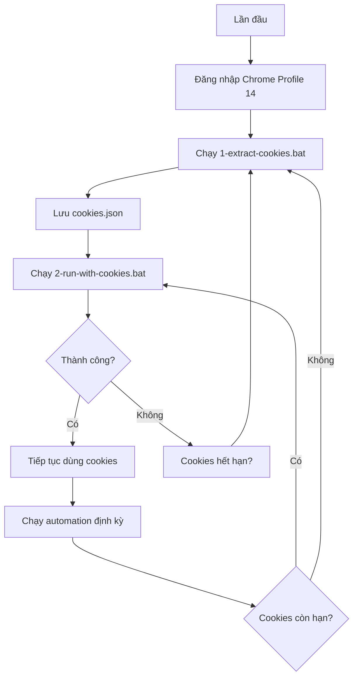

# 🍪 Hướng Dẫn Sử Dụng Cookies cho Automation

## 🎯 Tổng Quan

Thay vì phải sử dụng Chrome profile (dễ bị lỗi lock), bạn có thể:
1. **Lấy cookies** từ Chrome profile một lần
2. **Lưu cookies** vào file
3. **Sử dụng cookies** cho các lần chạy automation sau

### ✅ Ưu Điểm

| Vấn đề | Dùng Profile | Dùng Cookies |
|--------|-------------|--------------|
| **Profile bị lock** | ❌ Hay bị | ✅ Không bao giờ |
| **Phải đóng Chrome** | ❌ Bắt buộc | ✅ Không cần |
| **Tốc độ** | 🐌 Chậm | ⚡ Nhanh |
| **Headless mode** | ❌ Khó | ✅ Dễ dàng |
| **Ổn định** | ⚠️ Trung bình | ✅ Cao |

### ⚠️ Lưu Ý Quan Trọng

- Cookies chứa **thông tin đăng nhập nhạy cảm**
- **KHÔNG** chia sẻ file `cookies.json` với người khác
- **KHÔNG** commit vào Git (đã có trong `.gitignore`)
- Cookies có thể **hết hạn** sau vài ngày/tuần

---

## 🚀 Cách Sử Dụng

### BƯỚC 1: Lấy Cookies (Chỉ làm 1 lần hoặc khi hết hạn)

#### Cách A - Dùng Batch File (Khuyến nghị):
```cmd
1-extract-cookies.bat
```

#### Cách B - Chạy trực tiếp:
```cmd
# Đóng Chrome trước
kill-chrome.bat

# Lấy cookies
node extract-cookies.js
```

**Script sẽ:**
1. Mở Chrome với Profile 14
2. Đi tới trang Sora
3. Lấy tất cả cookies
4. Lưu vào file `cookies.json`

**Kết quả:**
```
✅ Đã lưu vào: cookies.json
- Tổng số: 15 cookies
- Domains: chatgpt.com, sora.com, openai.com
```

---

### BƯỚC 2: Chạy Automation với Cookies

#### Cách A - Dùng Batch File (Khuyến nghị):
```cmd
2-run-with-cookies.bat
```

#### Cách B - Chạy trực tiếp:
```cmd
node sora-with-cookies.js
```

**Script sẽ:**
1. Đọc cookies từ `cookies.json`
2. Mở Chrome mới (không cần profile)
3. Load cookies vào browser
4. Chạy automation như bình thường

---

## 📋 Quy Trình Làm Việc

### Lần đầu tiên:
```cmd
# 1. Đăng nhập vào Sora trong Chrome Profile 14
# (làm thủ công 1 lần)

# 2. Lấy cookies
1-extract-cookies.bat

# 3. Chạy automation
2-run-with-cookies.bat
```

### Các lần sau:
```cmd
# Chỉ cần chạy 1 lệnh:
2-run-with-cookies.bat
```

### Khi cookies hết hạn:
```cmd
# 1. Đăng nhập lại trong Chrome Profile 14

# 2. Lấy cookies mới
1-extract-cookies.bat

# 3. Chạy lại automation
2-run-with-cookies.bat
```

---

## 🔍 Chi Tiết Kỹ Thuật

### File Cấu Trúc

```
claude-web-demo/
├── extract-cookies.js          ← Script lấy cookies
├── sora-with-cookies.js        ← Script chạy với cookies
├── 1-extract-cookies.bat       ← Batch file lấy cookies
├── 2-run-with-cookies.bat      ← Batch file chạy với cookies
├── cookies.json                ← File lưu cookies (tự động tạo)
└── .gitignore                  ← Bảo vệ cookies.json
```

### Cấu Trúc File cookies.json

```json
{
  "extractedAt": "2025-01-09T10:30:00.000Z",
  "profile": "Profile 14",
  "url": "https://sora.chatgpt.com/",
  "cookies": [
    {
      "name": "session_token",
      "value": "ey...",
      "domain": ".chatgpt.com",
      "path": "/",
      "expires": 1234567890,
      "httpOnly": true,
      "secure": true
    }
    // ... more cookies
  ],
  "stats": {
    "total": 15,
    "domains": ["chatgpt.com", "sora.com", "openai.com"]
  }
}
```

---

## ⚙️ Tùy Chỉnh

### Thay Đổi Profile Path

Sửa trong file `extract-cookies.js`:
```javascript
const PROFILE_PATH = 'C:\\Users\\YOUR_USERNAME\\AppData\\Local\\Google\\Chrome\\User Data';
const PROFILE_DIR = 'Profile 14';  // Hoặc profile khác
```

### Chạy Headless Mode

Sửa trong file `sora-with-cookies.js`:
```javascript
const browser = await puppeteer.launch({
    headless: true,  // Đổi thành true để chạy ngầm
    // ...
});
```

### Thay Đổi Timeout

```javascript
const timeout = 30000;  // Tăng lên 30 giây
```

---

## ❗ Xử Lý Lỗi

### Lỗi: "Không tìm thấy file cookies.json"

**Nguyên nhân:** Chưa chạy bước 1

**Giải pháp:**
```cmd
1-extract-cookies.bat
```

---

### Lỗi: "Failed to launch the browser process"

**Nguyên nhân:** Chrome đang mở và đang dùng profile

**Giải pháp:**
```cmd
# Đóng Chrome
kill-chrome.bat

# Thử lại
1-extract-cookies.bat
```

---

### Lỗi: Automation thất bại dù có cookies

**Nguyên nhân:** Cookies đã hết hạn

**Triệu chứng:**
- Script mở trang nhưng bị đá về trang login
- Timeout khi tìm elements
- Không thấy giao diện đã đăng nhập

**Giải pháp:**
```cmd
# 1. Đăng nhập lại trong Chrome Profile 14
# 2. Lấy cookies mới
1-extract-cookies.bat

# 3. Chạy lại
2-run-with-cookies.bat
```

---

### Cảnh báo: "Cookies đã cũ hơn 7 ngày"

**Ý nghĩa:** Cookies có thể sắp hết hạn

**Khuyến nghị:**
```cmd
# Lấy cookies mới để đảm bảo
1-extract-cookies.bat
```

---

## 🔐 Bảo Mật

### ✅ Những Gì ĐÃ Làm

1. **File `.gitignore`**: Ngăn commit `cookies.json` vào Git
2. **Cảnh báo**: Script luôn nhắc nhở về bảo mật
3. **Lọc cookies**: Chỉ lấy cookies cần thiết

### ⚠️ Những Gì BẠN CẦN LÀM

1. **KHÔNG** chia sẻ file `cookies.json`
2. **KHÔNG** upload lên internet
3. **KHÔNG** gửi qua email/chat
4. **XÓA** file `cookies.json` khi không dùng nữa

### 🗑️ Xóa Cookies

```cmd
# Windows
del cookies.json

# Hoặc đơn giản: xóa file trong File Explorer
```

---

## 📊 So Sánh Các Phương Pháp

| Phương pháp | Độ khó | Ổn định | Tốc độ | Khuyến nghị |
|-------------|---------|---------|--------|-------------|
| **Cookies** | ⭐⭐ Dễ | ⭐⭐⭐⭐⭐ | ⚡⚡⚡ | ✅ **NHẤT** |
| **Remote Debug** | ⭐⭐⭐ TB | ⭐⭐⭐⭐ | ⚡⚡ | ✅ Tốt |
| **Profile trực tiếp** | ⭐ Rất dễ | ⭐⭐ Kém | ⚡ | ❌ Không khuyến nghị |

---

## 💡 Tips & Tricks

### 1. Kiểm Tra Cookies Còn Hạn

```cmd
# Xem thông tin cookies
type cookies.json | findstr "extractedAt"
```

### 2. Backup Cookies

```cmd
# Backup trước khi lấy mới
copy cookies.json cookies.backup.json
```

### 3. Chạy Multiple Scripts

Bạn có thể chạy nhiều instance cùng lúc vì không lo profile lock:

```cmd
# Terminal 1
node sora-with-cookies.js

# Terminal 2
node sora-with-cookies.js

# ... (có thể chạy nhiều cùng lúc)
```

### 4. Scheduled Tasks

Tạo Windows Task Scheduler để chạy tự động:
```cmd
# Mỗi ngày lúc 9:00 AM
schtasks /create /tn "Sora Automation" /tr "D:\tmp\claude-web-demo\2-run-with-cookies.bat" /sc daily /st 09:00
```

---

## 🎯 Best Practices

### Quy Trình Khuyến Nghị



### Frequency Recommendations

- **Lấy cookies mới**: Mỗi 5-7 ngày
- **Kiểm tra cookies**: Trước mỗi lần chạy
- **Backup cookies**: Trước khi lấy mới

---

## 🆘 Hỗ Trợ

### File Liên Quan

- `extract-cookies.js` - Script lấy cookies
- `sora-with-cookies.js` - Script chạy với cookies
- `1-extract-cookies.bat` - Batch lấy cookies
- `2-run-with-cookies.bat` - Batch chạy với cookies
- `FIX-ERRORS.md` - Troubleshooting chung

### Debugging

Thêm logs để debug:
```javascript
// Trong sora-with-cookies.js
console.log('Cookies:', cookiesData.cookies.length);
console.log('Current URL:', await page.url());
console.log('Page title:', await page.title());
```

---

## 🎉 Kết Luận

**Sử dụng cookies là cách TỐT NHẤT** để chạy Puppeteer automation với Sora:

✅ Không lo profile lock
✅ Chạy nhanh và ổn định
✅ Có thể chạy headless
✅ Dễ dàng scale

**Bắt đầu ngay:**
```cmd
1-extract-cookies.bat
2-run-with-cookies.bat
```

**Chúc bạn automation thành công! 🚀**
